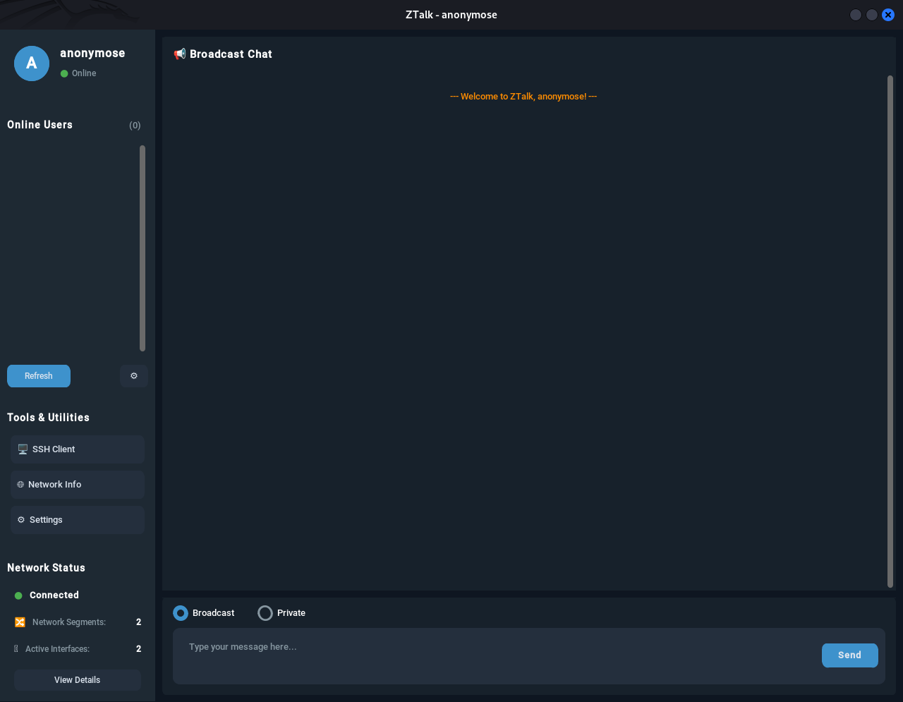

# ZTalk

ZTalk is a modern cross-platform chat application that enables users to communicate over a local network using both private messages and broadcasts. It features automatic service discovery, making it easy to find and connect with other users on the same network.



## Features

- 🌍 **Cross-platform**: Works on Windows, macOS, and Linux
- 🔍 Automatic peer discovery using Zeroconf
- 💬 Private messaging between users
- 📢 Network-wide broadcast messaging
- 🌐 Dynamic network interface detection
- 🔄 Automatic reconnection on network changes
- 🌙 Light/dark mode and customizable themes
- 🎨 Modern, intuitive user interface with CustomTkinter
- 🔐 **Integrated SSH client** with tabbed interface for multiple connections
- 🌉 **Cross-subnet discovery** with virtual network bridging

## Requirements

- Python 3.6+ (3.8+ recommended)
- Required packages:
  - zeroconf
  - netifaces
  - customtkinter>=5.2.0
  - pillow
  - ipaddress

## Installation

### Linux

1. Clone the repository:
```bash
git clone [repository-url]
cd ztalk
```

2. Install dependencies:
```bash
# Install system dependencies
sudo apt-get update
sudo apt-get install python3-venv python3-dev

# Create virtual environment
python3 -m venv .venv
source .venv/bin/activate

# Install Python dependencies
pip install -r requirements.txt
```

3. Run the application:
```bash
python main.py
```

### macOS

1. Clone the repository:
```bash
git clone [repository-url]
cd ztalk
```

2. Install dependencies:
```bash
# Install Homebrew if not already installed
/bin/bash -c "$(curl -fsSL https://raw.githubusercontent.com/Homebrew/install/HEAD/install.sh)"

# Create virtual environment
python3 -m venv .venv
source .venv/bin/activate

# Install Python dependencies
pip install -r requirements.txt
```

3. Run the application:
```bash
python main.py
```

### Windows

1. Clone the repository:
```bash
git clone [repository-url]
cd ztalk
```

2. Install dependencies:
```bash
# Create virtual environment
python -m venv .venv
.venv\Scripts\activate

# Install Python dependencies
pip install -r requirements.txt
```

3. Run the application:
```bash
python main.py
```

## Usage

Once running, you'll be prompted to enter a username. After that, the modern user interface will provide the following features:

- **Broadcast Messages**: Send messages to all connected users
- **Private Messages**: Select a user from the sidebar and send them a direct message
- **User List**: View all connected users in the sidebar
- **Settings**: Customize appearance settings (light/dark mode) and color themes
- **Auto-refresh**: The user list automatically refreshes to show new users
- **SSH Client**: Access the integrated SSH client for connecting to remote servers
- **Network Information**: View detailed information about your network configuration

### SSH Client

The integrated SSH client provides:

- Connect to multiple SSH servers simultaneously with a tabbed interface
- Save and load connection profiles for quick access
- Auto-detection of SSH key files
- Ability to generate new SSH keys
- Cross-platform compatibility (Windows, macOS, Linux)
- Automatic installation of required SSH packages (when possible)

To use the SSH client:

1. Click on the "SSH Client" button in the sidebar
2. Click "Connect" to set up a new SSH connection
3. Enter the hostname, port, username, and optional SSH key path
4. Click "Connect" to establish the connection
5. Use the tabbed interface to switch between active connections

## Network Requirements

- The application requires at least one active network interface
- Both UDP multicast and TCP connections must be allowed on your network
- Default ports will be automatically selected and displayed on startup
- For cross-subnet communication, the application can create virtual bridges (requires appropriate permissions)

## Advanced Network Features

ZTalk includes advanced network discovery capabilities that work across subnets:

- **Network Segmentation**: Automatically detects different network segments
- **Virtual Bridges**: Can create virtual network bridges to connect different network segments
- **ARP Conflict Detection**: Identifies and manages potential ARP conflicts
- **Cross-Subnet Routing**: Intelligently routes messages across different subnets

## Architecture

ZTalk uses a hybrid networking approach:
- TCP for reliable private messaging
- UDP multicast for broadcast messages
- Zeroconf (Bonjour) for service discovery
- Dynamic network interface monitoring
- Virtual bridges for cross-subnet communication
- CustomTkinter for a cross-platform modern UI

## Building Standalone Executables

### Windows (using PyInstaller)

```bash
pip install pyinstaller
pyinstaller --noconfirm --onedir --windowed --name ZTalk --add-data ".venv/Lib/site-packages/customtkinter;customtkinter/" main.py
```

### macOS (using PyInstaller)

```bash
pip install pyinstaller
pyinstaller --noconfirm --onedir --windowed --name ZTalk --add-data ".venv/lib/python3.x/site-packages/customtkinter:customtkinter/" main.py
```

### Linux (using PyInstaller)

```bash
pip install pyinstaller
pyinstaller --noconfirm --onedir --windowed --name ZTalk --add-data ".venv/lib/python3.x/site-packages/customtkinter:customtkinter/" main.py
```

## Troubleshooting

If you encounter issues:

1. Ensure you have proper network connectivity
2. Check if your firewall allows UDP multicast and TCP connections
3. Verify all required dependencies are installed
4. For platform-specific issues:
   - **Windows**: Ensure you have appropriate permissions for network access
   - **macOS**: Check if any security settings are blocking network access
   - **Linux**: Some distributions may require additional permissions for network discovery
5. For cross-subnet discovery issues:
   - Ensure you have appropriate permissions to create network bridges
   - Check if your network policy allows cross-subnet communication
   - For corporate networks, consult with your network administrator

## Security Note

The application requires network access for discovery and messaging. Basic security features include:

- SSH connections use standard SSH security protocols
- Network segmentation helps isolate traffic
- ARP conflict detection prevents basic spoofing attacks

However, chat messages are not end-to-end encrypted, so use on trusted networks only. 